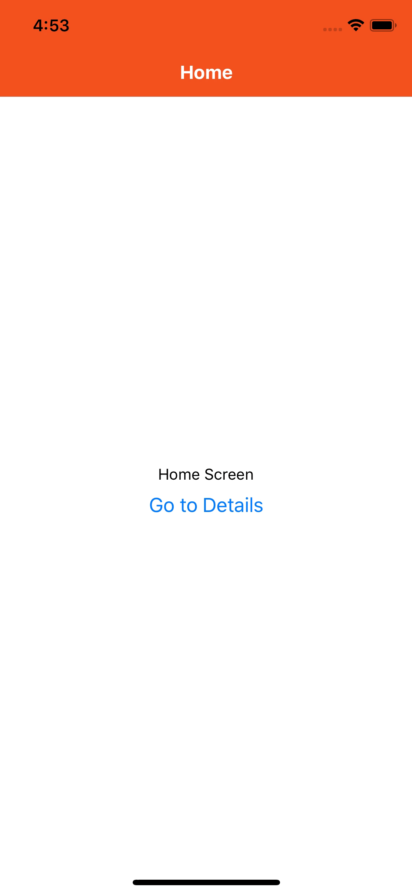

[source: https://reactnavigation.org/docs/en/headers.html#overriding-shared-navigationoptions](https://reactnavigation.org/docs/en/headers.html#overriding-shared-navigationoptions)

> The `navigationOptions` specified on your screen component are merged together with the default navigation options of its parent stack navigator, with the `options` on the screen component taking precedence. Let's use this knowledge to invert the background and tint colors on the details screen.

```js
class DetailsScreen extends React.Component {
  static navigationOptions = ({ navigation, navigationOptions }) => {
    const { params } = navigation.state;

    return {
      title: params ? params.otherParam : 'A Nested Details Screen',
      /* These values are used instead of the shared configuration! */
      headerStyle: {
        backgroundColor: navigationOptions.headerTintColor,
      },
      headerTintColor: navigationOptions.headerStyle.backgroundColor,
    };
  };

  /* render function, etc */
}

```

We do most of the work in the `DetailsScreen` module in the `setDynamicNavigationOptions` function.

This section calls for us to take some of that style values and reverse them. We have access to the values on the `NavigationOptions` param that we can access in `setDynamicNavigationOptions` as seen below.

The problem I ran up against was the values come in typed as `ReactNavigation.NavigationOptions.t` but to use them in creating new `ReactNative.Style` values we have to convert them to something we can use. Here that is `Js.t`. So at the top of the file, you see what is referred to in the [bucklescript docs](https://bucklescript.github.io/docs/en/interop-cheatsheet#identity-external) as `identity external` and in the [reason-docs](https://reasonml.github.io/docs/en/converting-from-js#types-pass-1):

```reason
external unsafeCast : ReactNavigation.NavigationOptions.t => Js.t('a) = "%identity";
```

Once we have a useable type, we moved the values around to get the desired effect. Read the inline notes below to see how it happened.

```reason
make->NavigationOptions.setDynamicNavigationOptions(params => {
    let navigation = params##navigation;
    let navigationOptions = params##navigationOptions;
    Js.log2("navigationOptions: ", navigationOptions);
    // log output of incoming values:
    // navigationOptions Object {
    //   "headerStyle": Object {
    //     "backgroundColor": "#f4511e",
    //   },
    //   "headerTintColor": "#fff",
    //   "headerTitleStyle": Object {
    //     "fontWeight": "bold",
    //   },
    // }
    // identity type switch at top of file: `external toJst: ReactNavigation.NavigationOptions.t => 'a = "%identity";` converts from one type to `'a`:any type which we can then use later to switch colors. This cant be right but it works.
    // have to do identity hack because:
    // ```
    // ReactNavigation.NavigationOptions.t
    // type t
    // <root>/src/OverrideSharedOptionsDemo.re

    // Error: This expression has type
    //          ReactNavigation.NavigationOptions.t =
    //            ReactNavigation.NavigationOptions.t
    //        but an expression was expected of type Js.t('a
    // ```
    // comment out this line to see the error generated
    let navigationOptions = unsafeCast(navigationOptions);
    // incoming headerTintColor to be passed to `newHeaderStyle`
    let navigationOptionsheaderTintColor = navigationOptions##headerTintColor;
    // incoming headerStyle.backgroundColor to be passed to `newHeaderTintColor`
    let navigationOptionsheaderStylebackgroundColor =
      navigationOptions##headerStyle##backgroundColor;
    // this should be the same as the old headerStyle background color
    let newHeaderTintColor = navigationOptionsheaderStylebackgroundColor;
    // this should be the same as the old headerTintColor
    let newHeaderStyle: ReactNative.Style.t =
      Style.(style(~backgroundColor=navigationOptionsheaderTintColor, ()));

    let title =
      navigation->Navigation.getParamWithDefault(
        "otherParam",
        "A Nested Details Screen",
      );
    // pass new values to NavigationOptions
    NavigationOptions.t(
      ~title,
      ~headerStyle=newHeaderStyle,
      ~headerTintColor=newHeaderTintColor,
      (),
    );
  });
```

This is what it looks like:


